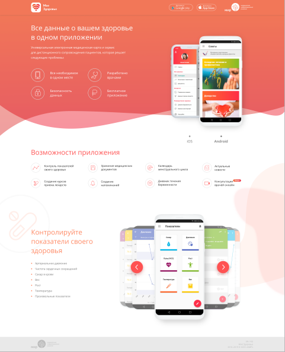
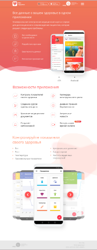
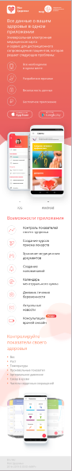

# Проект «Моё здоровье»

* Вёрстка: [Алёна Стасенко](https://github.com/KudriPro).
* Макет: [Медицинские информационные решения](https://www.medsolutions.ru).

## Описание
> Тестовый проект «Универсальная электронная медицинская карта и сервис для дистанционного сопровождения пациентов»
---

* Используемые технологии: _HTML, CSS, БЭМ, JS, Адаптивный дизайн_.
* Автоматизация: _Gulp_.
* Фреймворки: _нет_
* Препроцессоры: _LESS_
* JS модули: _[галерея]_.

## Ссылки
<table>
  <tr>
  <th><a href="https://kudripro.github.io/my_health/">Главная страница 1560px</a></th>
  <th><a href="https://kudripro.github.io/my_health/">Главная страница 768px</a></th>
  <th><a href="https://kudripro.github.io/my_health/">Главная страница 360px</a></th>
  </tr>
  <tr valign="top">
    <td>
      
    </td>
    <td>
          
    </td>
    <td>
          
    </td>
  </tr>
</table>

